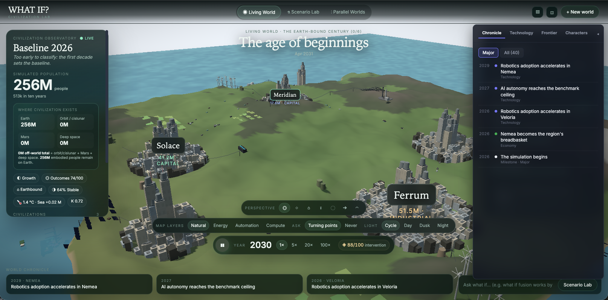
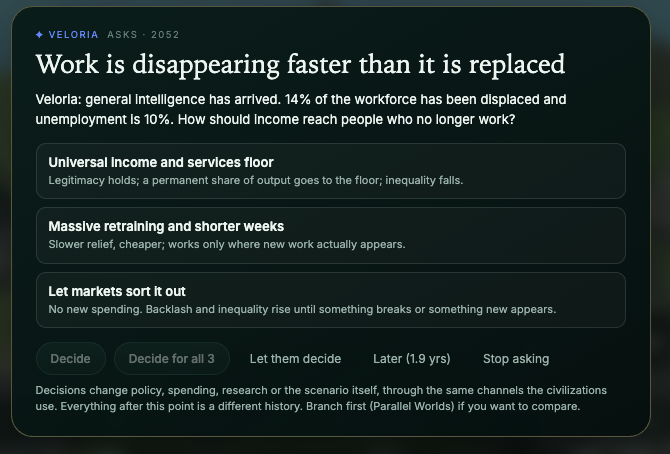
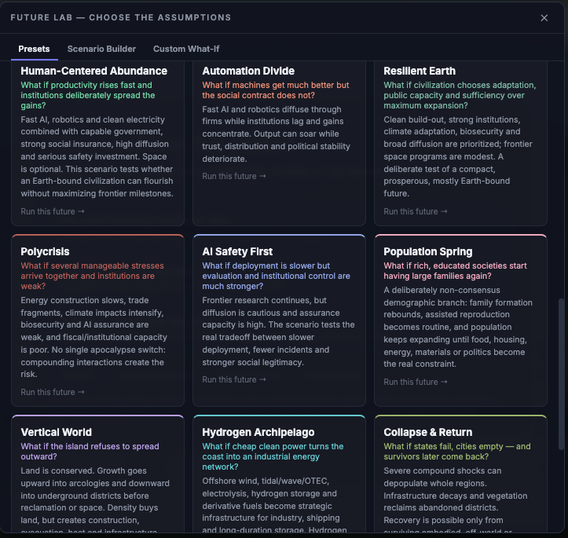
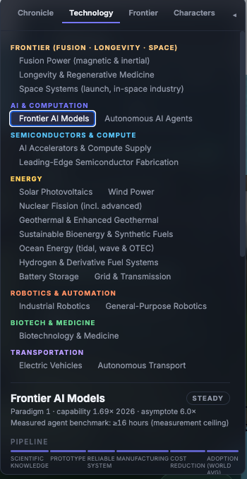

# WHAT IF? Civilization Lab

Play it: https://aicivilization.fyi

I gave AI agents a world and asked them to make it behave like a civilization.

This project simulates a civilization instead of building a city, sketching a technology roadmap, or scripting a happy ending.

Author: **Tamir Khason** ([@tamir](https://x.com/tamir)) • [LinkedIn](https://www.linkedin.com/in/tamirk/)

Three invented countries share one finite island. People are born, grow old, migrate and die. Power plants wear out. Farms lose land. Governments borrow. Scientists fail. Elections and wars change what gets built. Cities rise, dig downward, move onto and under the sea, spread into orbit and eventually stop treating Earth as the center of civilization.

Then the clock runs one month at a time.

Nobody, including me, knows in advance where it ends.

## Why I built it

We hand consequential decisions to systems that contain models of people inside them.

A credit model carries a theory of risk. A medical triage system carries a theory of urgency. A policy model carries a theory of what matters, what can be measured and which losses are acceptable. Usually we only see the answer. The assumptions sit buried in code, training data and architecture.

Here, the assumptions are the thing you're supposed to look at.

When this world does something that feels disturbingly familiar, inspect why. When it does something absurd, use that: you've found a place where the machine's picture of civilization is wrong.

## How it was built

The idea started with Cagri Kacmaz's [project](github.com/cagrikacmaz/gpt-6-astra-vs-gemini-3-8-flash) comparing GPT-6 Astra and Gemini 3.8 Flash on the same build brief, and with a talk I gave to a forum of senior tech and business executives about which human skills keep their value once AI makes answers cheap. Both left me with the same question: what does a model actually believe about how a civilization works, once you force it to build one instead of describe one?

I didn't sit down and write a future. I wrote a brief: start close to the world we know, use real research where evidence exists, make resources finite, make infrastructure age, make causes inspectable, never let a scenario secretly dictate its ending.

Agents researched, designed and implemented the simulation. Other agents red-teamed it. I red-teamed their red teams. Every time we found a hidden destiny, a convenient visual lie or a model that produced the answer it had been named after, we changed the model.

Earlier versions assumed that successful societies naturally converge toward low population, that fusion and space expansion define progress by default, that sea level follows temperature almost immediately, and that an abandoned city can be represented by shrinking its buildings.

Those shortcuts hid beliefs inside mechanics.

The current rule is stricter: the visible world can't contradict the simulated world, and the simulated world can't smuggle a preferred future in as physics.

Buildings keep their locations. Empty towers go dark instead of shrinking. Marine habitats need moorings, power and maintenance. Underground districts sit below the ground, not as glowing icons drawn through it. A Mars base can exist without anybody living there. A civilization can become technologically extraordinary and socially miserable. A smaller Earth-bound society can flourish. A population can recover, explode, fragment, leave Earth or reach zero.

If the last population disappears, civilization stops producing history. Research stops. Launches stop. The clock keeps moving, but what remains is climate inertia, water, corrosion, structural failure, ruins and ecological succession.

At turning points, the simulation stops and asks the player a question, like this one from 2052. The decisions change policy, spending, research or the scenario itself, through the same channels the civilizations use.

## This is not a forecast

The Lab is a causal counterfactual model. It isn't an Earth digital twin, and it isn't a probability distribution over the future.

Near-term quantities can be calibrated against published evidence. Farther out, evidence thins and structural assumptions carry more weight. The project tries to make that boundary visible instead of covering it with precise-looking numbers.

The scenarios are questions, not predictions.

**Human-Centered Abundance** asks what happens if capability rises quickly and institutions spread the gains.

**Automation Divide** asks what happens if the machines improve faster than the social contract.

**Population Spring** lets fertility recover and makes physical capacity matter again.

**Vertical World** grows upward and downward before consuming more surface land.

**Ocean Century** treats the sea as a serious habitat and industrial frontier rather than scenery.

**Deep Diaspora** asks what happens when Earth gradually stops being the center of population.

**Collapse & Return** tests whether territories can truly empty, decay and later be resettled by conserved survivors.

**Terminal Cascade** asks whether the model can actually lose everyone, and what the physical world does afterward.

A scenario changes the pressures without dictating the ending.

## What you should notice on the screen

The 3D world renders the simulation's internal state. Nothing on screen exists purely for decoration.

A growing city fills its fixed lots, redevelops them, and eventually adds explicit high-density structures, all without pushing old buildings sideways to make room. Underground growth adds deeper chambers and shafts. Subsea growth moves farther onto the shelf and into deeper pressure-rated structures. Floating districts need connections and moorings. Off-world settlement gets its own location ledger, so hundreds of millions of people can't silently disappear into a number called "off Earth."

Decay is physical too. Buildings lose occupants and light first. Maintenance stops. Different systems fail at different speeds. Roofs, facades and frames collapse unevenly. Rubble and foundations remain. Vegetation starts in cracks and empty lots, then grows through the city. Concrete and steel decay. They don't evaporate because a chart reached zero.

Use Below ground to inspect subsurface settlements from beneath the terrain instead of projecting them through the surface. Use Beyond Earth when population and industry move off-world. The frontier geometry stays intentionally schematic instead of pretending the island, orbit and Mars share one literal scale.

I kept four questions close to the world on the interface: what's happening, why it's happening, what's preventing something else from happening, and what changed when I changed one assumption. If a number looks strange, inspect its cause before you accept it because it came from a simulation.

## Try breaking it

Run Baseline for a century or two. If population stalls, find the mechanism. There's no target population hidden in the code.

Put Human-Centered Abundance beside Automation Divide in Parallel Worlds. Similar capability can produce very different lives.

Run Vertical World and look below the surface as it grows. Run Ocean Century and check whether a sea-based civilization stays serviceable, rather than just building impressive structures and abandoning them.

Run Collapse & Return long enough for vegetation to reclaim abandoned districts. If settlers return, they come from a surviving population; the model can't respawn them.

Run Terminal Cascade. If everybody dies, keep the clock moving. History stops. Nature doesn't.

Change one assumption and run it again. Each run shows the future as a collision between systems running on different clocks, more than as a list of inventions.

## What counts as progress here

There's no score called "advanced civilization."

The model separates what a civilization can do from how well its members and institutions are doing. It tracks material security, human development, institutional health, ecological safety, distribution and resilience separately from whether the civilization is Earth-bound, oceanic, digital or spacefaring.

A Type-I civilization can still be brittle, unequal and awful to live in. A civilization that never builds a Mars city can still be a very good outcome.

Technology changes the available choices, without determining whether they're wise ones.

## Argue with the model

The repository is open because the project stays unfinished in the useful sense: every model of civilization should stay attackable.

`MASTER_PROMPT.md` is the reconstruction constitution. Another model or agent swarm can recreate the project creatively from it without copying this implementation. The main idea and epistemic rules stay fixed; architecture, algorithms, scenarios and presentation can change if a better solution exists.

`knowledge/` holds research notes, evidence and unresolved questions. `RED_TEAM_REPORT.md` records assumptions and failure modes already found. `VALIDATION_REPORT.md` says what's actually been tested. `CHANGES.md` records why important mechanics changed. Developers need one more document: `README-DEV.md`.

If you find a rule that makes no sense, challenge it. If you find a future this model can't represent, add it. If the simulation does something you believe without questioning, challenge that too. The worst modelling errors usually come from assumptions that look like common sense, not the ones that look absurd.

Special thank to [Yair Lifshitz](https://www.linkedin.com/in/yairlifshitz/) for hosting on [xhostd](https://xhostd.com/)
